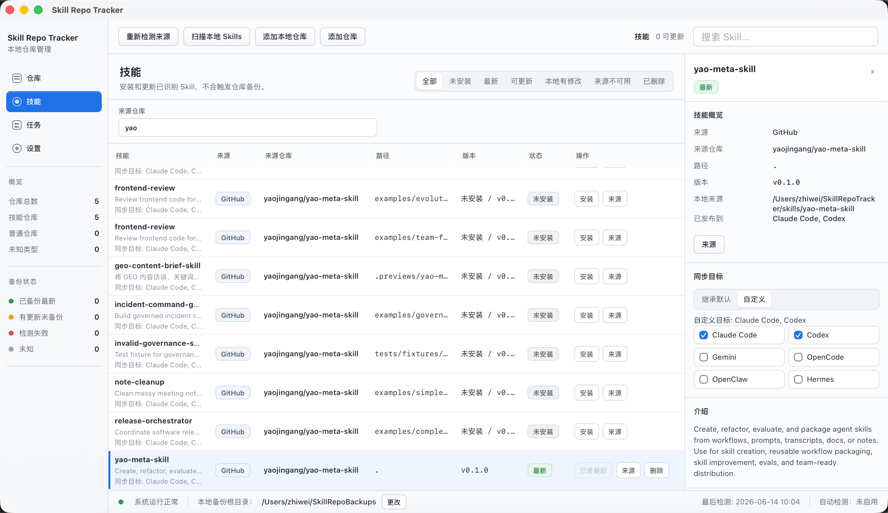

# Skill Repo Tracker

[中文](#中文) | [English](#english)




## 中文

Skill Repo Tracker 是一个给 AI Skill 使用者准备的本地桌面工具。它解决的不是“再做一个仓库列表”，而是把散落在 GitHub、Claude Code、Codex 和本机目录里的 Skills 收回来，变成一个能看清来源、能安全更新、能随时回退的本地工作台。

如果你经常从多个仓库安装 Skills，最容易遇到三类麻烦：

- 不知道哪个 Skill 来自哪个仓库、哪个路径、哪个版本。
- 手动复制到不同工具目录后，更新和删除都容易乱。
- 覆盖前没有备份，出了问题才发现没有可追溯记录。

Skill Repo Tracker 的做法是：所有 Skill 先进入一个独立主库，再按你的选择发布到工具目录。主库默认在 `~/SkillRepoTracker/skills`，当前默认发布到 Claude Code 和 Codex。Gemini、OpenCode、OpenClaw、Hermes 可以手动勾选，但不会默认打开。

当前版本：`v1.1.2`

### 它帮你完成什么

- **统一看见来源**：添加 GitHub 仓库后，应用会识别其中的 `SKILL.md`，显示仓库、路径、版本和安装状态。
- **安全安装和更新**：更新 Skill 前会检查本地内容是否被改过，避免静默覆盖你的修改。
- **一份主库，多处发布**：Skill 永远先写入独立主库，再复制到 Claude Code、Codex 等目标目录。
- **取消同步可追溯**：取消某个目标后，应用只会处理自己发布过的副本；执行取消同步时会先备份，再从目标工具目录移除。
- **源码快照备份**：仓库更新可以保存 ZIP、manifest 和任务日志，方便以后审计或回滚。
- **隐私友好**：GitHub token 存在 macOS Keychain，不写入 SQLite、manifest 或任务日志。

### 同步到底是什么意思

同步不是把你的工具目录当成主库。真正的主库只有一份：`~/SkillRepoTracker/skills`。

- 安装、更新、恢复：先写入主库，再复制到已勾选的同步目标。
- 取消勾选默认目标：保存后只改变后续策略，不会立刻删除文件。
- 点击“应用同步设置到已安装 Skills”：把新的默认目标应用到已安装 Skills；被取消的已发布副本会先备份到 `~/SkillRepoTracker/sync-backups/...`，再从对应工具目录移除。
- 单个 Skill 选择“自定义目标”：保存后立即对这个 Skill 生效。
- 自定义目标为空：这个 Skill 只保留在主库，不发布到任何工具。

应用只会删除 `skill_sync_records` 中记录为“本应用发布过”的目标副本，不会清理你手动维护的其他目录。

### 推荐工作流

1. 添加一个包含 `SKILL.md` 的 GitHub 仓库。
2. 在“技能”页检查识别出的 Skill、来源路径和版本。
3. 安装 Skill，让它进入 `~/SkillRepoTracker/skills`。
4. 默认发布到 Claude Code 和 Codex；如果需要其他工具，在设置里勾选目标。
5. 更新或取消同步前，先看任务日志和备份路径，确认动作可追溯。

### 数据位置

- 默认 Skill 主库：`~/SkillRepoTracker/skills`
- 默认同步备份：`~/SkillRepoTracker/sync-backups`
- 默认源码备份：`~/SkillRepoBackups`
- 默认同步目标：`~/.claude/skills`、`~/.codex/skills`
- 可选同步目标：`~/.gemini/skills`、`~/.config/opencode/skills`、`~/.openclaw/skills`、`~/.hermes/skills`
- SQLite 数据库：macOS 应用数据目录下的 `skill-repo-tracker.sqlite`
- GitHub token：macOS Keychain

### 本地运行

环境要求：

- macOS 12+
- Node.js 20+
- npm 10+
- Rust / Cargo 1.77+

安装依赖：

```bash
npm install
```

启动 Web 预览：

```bash
npm run dev
```

启动 Tauri 桌面开发版：

```bash
npm run tauri dev
```

Web 预览使用 mock state；Tauri 桌面版会调用真实 Rust commands、SQLite、文件系统和 GitHub API。

### 构建和验证

生成 macOS `.app` 和 `.dmg`：

```bash
npm run tauri build -- --bundles app,dmg
```

常见产物位置：

- `src-tauri/target/release/bundle/macos/Skill Repo Tracker.app`
- `src-tauri/target/release/bundle/dmg/Skill Repo Tracker_1.1.2_*.dmg`

公开发布的 DMG 必须使用 Developer ID 签名并完成 Apple notarization。仅本地构建出的 unsigned 或 ad-hoc signed 产物适合开发验证，不应作为普通用户下载版本发布。

发布前建议运行：

```bash
npm run build
./node_modules/.bin/tsc --noEmit
cargo fmt --check --manifest-path src-tauri/Cargo.toml
cargo test --manifest-path src-tauri/Cargo.toml
```

如果系统找不到 `cargo`，macOS 上通常可以临时使用：

```bash
export PATH="$HOME/.cargo/bin:$PATH"
```

### 手动验收建议

1. 添加普通仓库，确认可以检测远端 SHA 和创建源码 ZIP 备份。
2. 添加包含 `SKILL.md` 的仓库，确认 Skill 页出现来源路径和版本。
3. 安装 Skill，确认主库写入 `~/SkillRepoTracker/skills`。
4. 确认默认同步目标只有 Claude Code 和 Codex。
5. 取消某个默认目标并保存，确认不会立刻删除文件。
6. 点击“应用同步设置到已安装 Skills”，确认任务日志记录备份、移除或跳过的目标。
7. 对单个 Skill 切到自定义目标，确认保存后立即同步当前 Skill。

### 为什么不是完整 Git mirror？

Skill Repo Tracker 备份的是当前 GitHub ref 的源码 ZIP 快照。这样更适合“我要留住这次可用状态”的本地工作流，也避免把 Git mirror、LFS、submodule 和增量 fetch 的复杂度带进一个桌面工具。

### License

MIT © 2026 xrevoman-hu

---

## English

Skill Repo Tracker is a local-first macOS app for people who install, update, and publish AI Skills across multiple tools.

Instead of treating Claude Code, Codex, Gemini, OpenCode, OpenClaw, or Hermes folders as the source of truth, the app keeps one independent Skill library at `~/SkillRepoTracker/skills`. Skills are installed there first, then copied to selected tool directories.

Current version: `v1.1.2`

### What It Helps With

- Track which GitHub repository, path, and version each Skill came from.
- Install and update Skills without silently overwriting local edits.
- Publish the same Skill library to Claude Code and Codex by default.
- Optionally publish to Gemini, OpenCode, OpenClaw, and Hermes.
- Back up published copies before replacing or removing them.
- Store GitHub tokens in macOS Keychain instead of SQLite or logs.

### Sync Semantics

The Skill library is the source of truth. Tool folders are publish targets.

Unchecking a default target and saving changes future installs, updates, and restores, but it does not immediately remove files. To apply the new defaults to installed Skills, use “Apply sync settings to installed Skills”. Removed published copies are backed up first, then removed from tool folders. Copies not created by this app are left alone.

### Development

```bash
npm install
npm run dev
npm run tauri dev
```

Build and verify:

```bash
npm run build
./node_modules/.bin/tsc --noEmit
cargo fmt --check --manifest-path src-tauri/Cargo.toml
cargo test --manifest-path src-tauri/Cargo.toml
npm run tauri build -- --bundles app,dmg
```

Generated artifacts:

- `src-tauri/target/release/bundle/macos/Skill Repo Tracker.app`
- `src-tauri/target/release/bundle/dmg/Skill Repo Tracker_1.1.2_*.dmg`

Public DMG releases must be signed with Developer ID and notarized by Apple. Unsigned or ad-hoc signed local builds are for development validation only.

### License

MIT © 2026 xrevoman-hu
