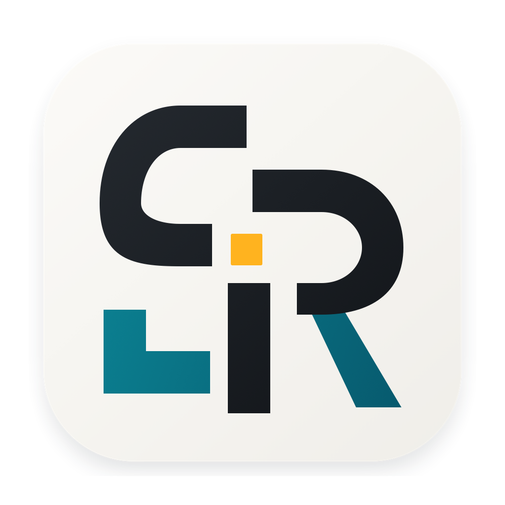
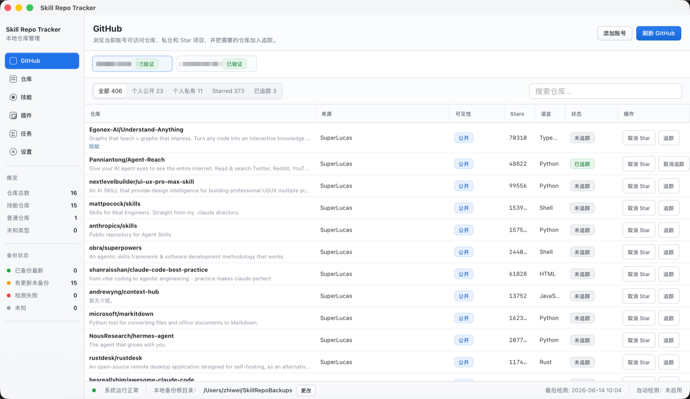
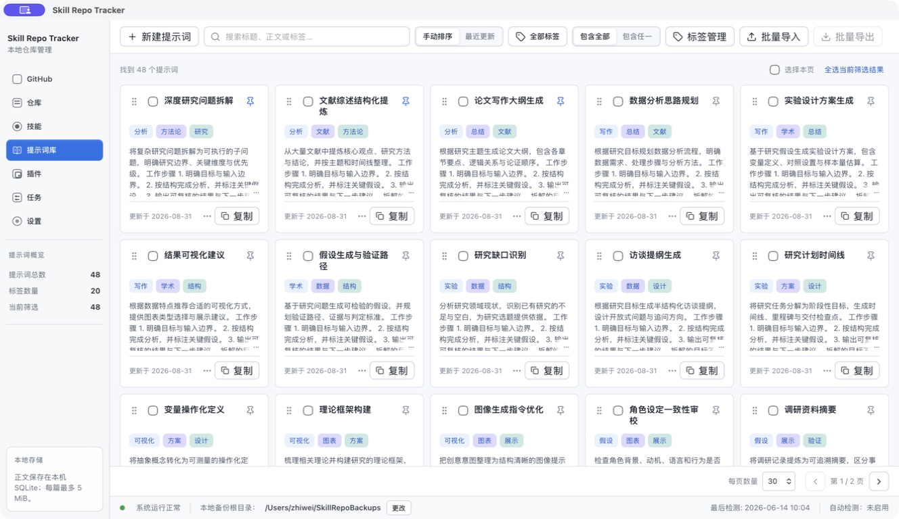
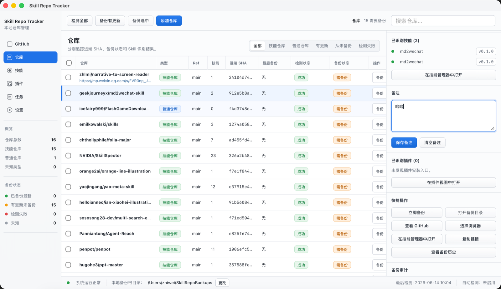
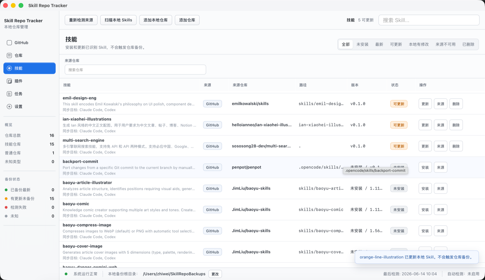
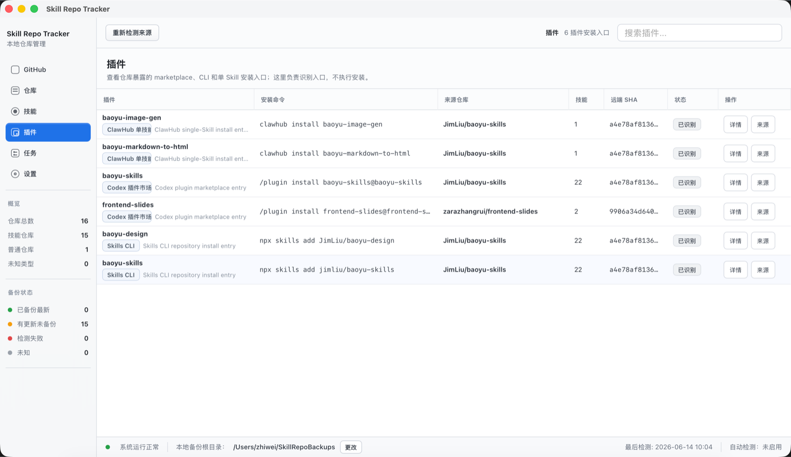
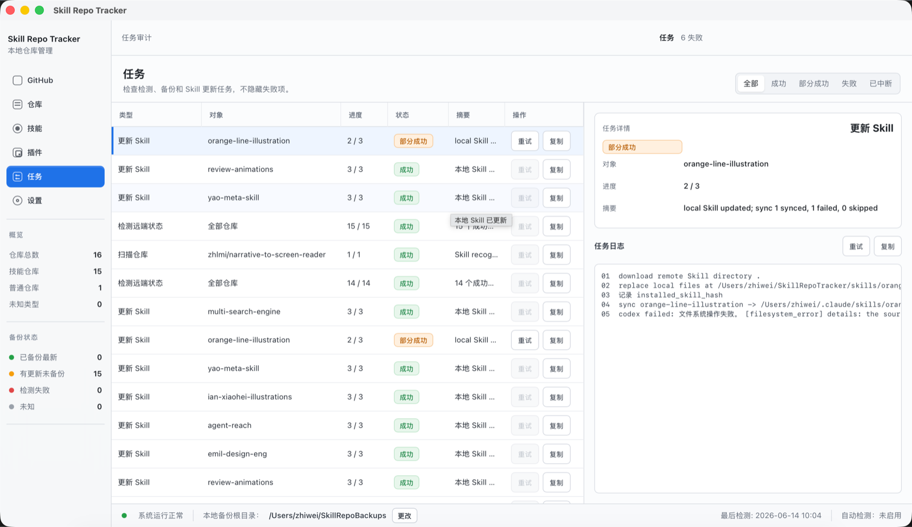
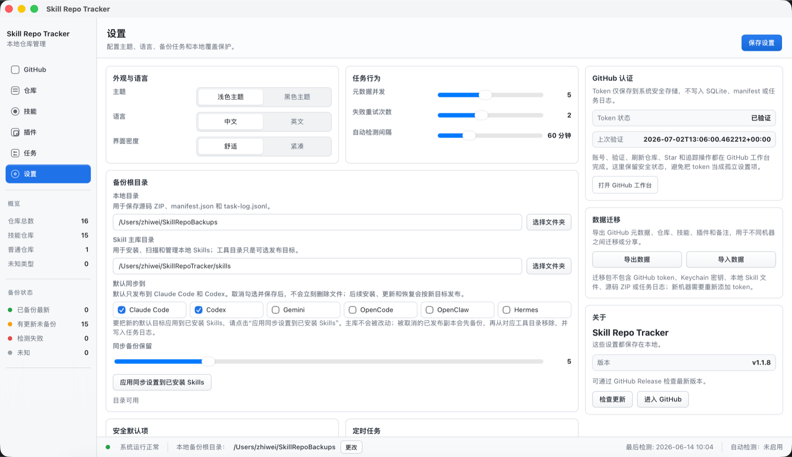

# Skill Repo Tracker

[中文](#中文) | [English](#english)


<p align="center">
  
</p>

<p align="center">
  
</p>

## 界面预览 / Interface Preview

提示词库为 v1.2.1 的脱敏演示库实机截图；其余界面为 v1.1.8 实机截图。The prompt library uses a sanitized v1.2.1 demo database; the remaining screens are real v1.1.8 app screenshots.

<p align="center">
  
</p>

<table>
  <tr>
    <td><strong>GitHub</strong><br /></td>
    <td><strong>仓库 / Repositories</strong><br /></td>
  </tr>
  <tr>
    <td><strong>技能 / Skills</strong><br /></td>
    <td><strong>插件 / Plugins</strong><br /></td>
  </tr>
  <tr>
    <td><strong>任务 / Tasks</strong><br /></td>
    <td><strong>设置 / Settings</strong><br /></td>
  </tr>
</table>

## 中文

Skill Repo Tracker 是一个给 AI Skill 使用者准备的本地桌面工具。它解决的不是“再做一个仓库列表”，而是把散落在 GitHub、Claude Code、Codex、本机目录和 README 插件入口里的线索收回来，变成一个能看清来源、能安全更新、能随时回退的本地工作台。

如果你经常从多个仓库安装 Skills，最容易遇到三类麻烦：

- 不知道哪个 Skill 来自哪个仓库、哪个路径、哪个版本。
- README 里有 `/plugin install`、CLI 或单 Skill 安装命令，但不知道它从哪里来、关联哪些 Skill。
- 手动复制到不同工具目录后，更新和删除都容易乱。
- 覆盖前没有备份，出了问题才发现没有可追溯记录。

Skill Repo Tracker 的做法是：所有 Skill 先进入一个独立主库，再按你的选择发布到工具目录。主库默认在 `~/SkillRepoTracker/skills`，当前默认发布到 Claude Code 和 Codex。Gemini、OpenCode、OpenClaw、Hermes 可以手动勾选，但不会默认打开。

当前版本：`v1.2.3`

### 它帮你完成什么

- **统一看见来源**：添加 GitHub 仓库后，应用会识别其中的 `SKILL.md`，显示仓库、路径、版本和安装状态。
- **本地提示词库**：以卡片、标签、置顶、全文搜索、分页和持久化手动排序管理长提示词；详情默认只读，显式点击“编辑”后才允许修改。
- **复制、分享与回导**：单篇复制保留原始正文；单篇导出 UTF-8 Markdown，批量导出可分享、可预检回导的安全 ZIP。标签按规范化文本匹配，本机缺失的标签会自动创建。
- **识别安装入口**：插件页会收拢常见 marketplace、CLI 和单 Skill 安装入口，并关联来源仓库与 Skill；它是入口识别器，不是自动安装执行器。
- **多账号 GitHub 工作台**：每个 GitHub 账号都通过弹窗手动添加，个人公开仓库、个人私仓、Starred 和已追踪仓库可以在同一个工作台里筛选和操作。
- **本地备注同步**：GitHub 工作台和仓库页中的同一个 GitHub 仓库共用一条备注，也可以给 Skill 和插件入口记录用途。
- **迁移包导入导出**：设置页默认继续导出兼容的 v1 JSON；勾选提示词后使用 v2 `.srtmigration`，在另一台机器预检并合并导入。应用托管的 GitHub token 不会写入迁移包；提示词正文逐字、明文导出，正文里由用户粘贴的秘密也会随之导出，因此会显示警示和二次确认。
- **安全安装和更新**：更新 Skill 前会检查本地内容是否被改过，避免静默覆盖你的修改。
- **一份主库，多处发布**：Skill 永远先写入独立主库，再复制到 Claude Code、Codex 等目标目录。
- **取消同步可追溯**：取消某个目标后，应用只会处理自己发布过的副本；执行取消同步时会先备份，再从目标工具目录移除。
- **源码快照备份**：仓库更新可以保存 ZIP、manifest 和任务日志，方便以后审计或回滚。
- **隐私友好**：GitHub token 存在 macOS Keychain，不写入 SQLite、manifest 或任务日志。

### 同步到底是什么意思

同步不是把你的工具目录当成主库。真正的主库只有一份：`~/SkillRepoTracker/skills`。

- 安装、更新、恢复：先写入主库，再复制到已勾选的同步目标。
- 取消勾选默认目标：保存后只改变后续策略，不会立刻删除文件。
- 点击“应用同步设置到已安装 Skills”：把新的默认目标应用到已安装 Skills；被取消的已发布副本会先备份到 `~/SkillRepoTracker/sync-backups/...`，再从对应工具目录移除。
- 单个 Skill 选择“自定义目标”：保存后立即对这个 Skill 生效。
- 自定义目标为空：这个 Skill 只保留在主库，不发布到任何工具。

应用只会删除 `skill_sync_records` 中记录为“本应用发布过”的目标副本，不会清理你手动维护的其他目录。

### 推荐工作流

1. 在 GitHub 工作台手动添加需要管理的 GitHub 账号。
2. 从对应账号的仓库目录或 Starred 列表中追踪仓库；私仓请从持有权限的账号目录加入。
3. 在“技能”页检查识别出的 Skill、来源路径和版本。
4. 在“插件”页检查识别出的安装入口，必要时复制命令到对应工具里手动执行。
5. 安装 Skill，让它进入 `~/SkillRepoTracker/skills`。
6. 默认发布到 Claude Code 和 Codex；如果需要其他工具，在设置里勾选目标。
7. 更新或取消同步前，先看任务日志和备份路径，确认动作可追溯。

### 数据位置

- 默认 Skill 主库：`~/SkillRepoTracker/skills`
- 默认同步备份：`~/SkillRepoTracker/sync-backups`
- 默认源码备份：`~/SkillRepoBackups`
- 默认同步目标：`~/.claude/skills`、`~/.codex/skills`
- 可选同步目标：`~/.gemini/skills`、`~/.config/opencode/skills`、`~/.openclaw/skills`、`~/.hermes/skills`
- SQLite 数据库：macOS 应用数据目录下的 `skill-repo-tracker.sqlite`
- 提示词正文：保存在同一 SQLite 中；bundled SQLite 默认单值理论上限约 953.7 MiB，产品限制为每篇最多 `5,242,880` UTF-8 bytes（5 MiB）
- GitHub token：macOS Keychain

### 本地运行

环境要求：

- macOS 12+
- Node.js 22.23.1（Node 22）
- npm 10.9.8
- Rust / Cargo 1.95.0（声明并由 CI 验证的 MSRV 为 1.88.0）

安装依赖：

```bash
npm ci
```

启动 Web 预览：

```bash
npm run dev
```

启动 Tauri 桌面开发版：

```bash
npm run tauri dev
```

Web 预览使用 mock state；Tauri 桌面版会调用真实 Rust commands、SQLite、文件系统和 GitHub API。

### 构建和验证

本地与 CI 的确定性检查只有一个入口：

```bash
npm run verify
```

它固定执行版本/仓库/架构预算、TypeScript strict、Vitest、Vite build、包体预算、
Cargo fmt、Clippy `-D warnings`、Rust tests 和 Git diff 检查。`CI / verify` 会在该入口后
追加 Playwright E2E；Coverage、MSRV、网络安全审计、性能和 Release 实物是独立 lane，详见
[`docs/rules/testing-release.md`](docs/rules/testing-release.md)。

#### 免费分发测试包

没有 Apple Developer ID 时，可以使用 ad-hoc 测试分发 lane。唯一入口会先执行全部门禁和
性能测试，再构建、完整签名 `.app`、从该 App 重新封装 DMG、签名并只读挂载复验。
不能直接复用重签 App 之前生成的 DMG。

```bash
npm run release:verify -- --lane adhoc --version 1.2.3 --phase local
```

local phase 会在 DMG 旁生成受限权限交接清单，并输出一个单一、无签名的
`manifestToken`（把操作者交接的 version、完整 commit、文件名、bytes 与 SHA-256 放在
同一载体中）。发布后执行 remote phase 时必须传入这个 token；远端 main/tag commit
必须等于 manifest 中的 commit，下载文件和 GitHub digest/size 也必须与 manifest 一致。
该 token 用来避免逐字段混用，不证明 local gate 已执行，也不证明是谁生成了 token：

```bash
npm run release:verify -- --lane adhoc --version 1.2.3 --phase remote --manifest-token <LOCAL_MANIFEST_TOKEN>
```

这种包可以挂载、复制到 `/Applications` 并本机验证，但不是 Apple notarized 公开安装包。首次打开时，macOS 可能提示无法验证开发者；测试用户需要右键打开，或在“系统设置 -> 隐私与安全性”里选择“仍要打开”。安装测试包时请注意：

1. 从 GitHub Release 下载 `Skill.Repo.Tracker_1.2.3_aarch64.dmg`。
2. 双击打开 DMG，把 `Skill Repo Tracker.app` 拖入 `/Applications`。
3. 首次启动如果提示“无法验证开发者”或类似安全提示，请在 Finder 里右键这个 App，选择“打开”，再在弹窗中确认“打开”。
4. 如果右键打开仍被拦截，请进入“系统设置 -> 隐私与安全性”，在底部找到被拦截的 Skill Repo Tracker，点击“仍要打开”。
5. 技术用户也可以清除下载隔离属性：

```bash
xattr -cr "/Applications/Skill Repo Tracker.app"
```

如果要做到普通用户双击下载后无安全提示，仍然需要 Developer ID 签名并完成 Apple notarization。

发布前必须运行唯一门禁：

```bash
npm run verify
```

工具链版本由 `.node-version` 和 `rust-toolchain.toml` 固定；不要在发布说明中复制另一套
子命令。

### 手动验收建议

1. 添加普通仓库，确认可以检测远端 SHA 和创建源码 ZIP 备份。
2. 添加包含 `SKILL.md` 的仓库，确认 Skill 页出现来源路径和版本。
3. 安装 Skill，确认主库写入 `~/SkillRepoTracker/skills`。
4. 确认默认同步目标只有 Claude Code 和 Codex。
5. 取消某个默认目标并保存，确认不会立刻删除文件。
6. 点击“应用同步设置到已安装 Skills”，确认任务日志记录备份、移除或跳过的目标。
7. 对单个 Skill 切到自定义目标，确认保存后立即同步当前 Skill。

### 为什么不是完整 Git mirror？

Skill Repo Tracker 备份的是当前 GitHub ref 的源码 ZIP 快照。这样更适合“我要留住这次可用状态”的本地工作流，也避免把 Git mirror、LFS、submodule 和增量 fetch 的复杂度带进一个桌面工具。

### License

MIT © 2026 xrevoman-hu

---

## English

Skill Repo Tracker is a local-first macOS app for people who install, update, and publish AI Skills across multiple tools.

Instead of treating Claude Code, Codex, Gemini, OpenCode, OpenClaw, or Hermes folders as the source of truth, the app keeps one independent Skill library at `~/SkillRepoTracker/skills`. Skills are installed there first, then copied to selected tool directories.

Current version: `v1.2.3`

### What It Helps With

- Track which GitHub repository, path, and version each Skill came from.
- Manage long prompts locally with cards, tags, pinning, full-text search, pagination, and persistent manual ordering. Details remain read-only until Edit is explicitly selected.
- Copy the original prompt body, export one prompt as UTF-8 Markdown, or export a safe, shareable batch ZIP that can be preflighted and imported. Tags match by normalized text and missing local tags are created automatically.
- Recognize common plugin install entries from READMEs or plugin manifests and connect them back to their repository and Skills. This identifies install entries; it does not run installation.
- Manage multiple manually added GitHub accounts, including personal public repositories, private repositories, Starred repositories, and tracked repositories.
- Keep one shared local note for the same GitHub repository across the GitHub workbench and tracked repository view, plus notes for Skills and plugin entries.
- Keep the compatible v1 JSON migration by default, or opt into a v2 `.srtmigration` package that also carries prompts and tags with preflight conflict handling. App-managed GitHub tokens are excluded; prompt bodies are exported verbatim and in plaintext, including any secrets the user pasted into them, so the app warns and asks for confirmation first.
- Install and update Skills without silently overwriting local edits.
- Publish the same Skill library to Claude Code and Codex by default.
- Optionally publish to Gemini, OpenCode, OpenClaw, and Hermes.
- Back up published copies before replacing or removing them.
- Store GitHub tokens in macOS Keychain instead of SQLite or logs.

### Sync Semantics

The Skill library is the source of truth. Tool folders are publish targets.

Unchecking a default target and saving changes future installs, updates, and restores, but it does not immediately remove files. To apply the new defaults to installed Skills, use “Apply sync settings to installed Skills”. Removed published copies are backed up first, then removed from tool folders. Copies not created by this app are left alone.

### Development

```bash
npm ci
npm run dev
npm run tauri dev
```

The deterministic local and CI gate has one entry point: `npm run verify`. `CI / verify`
then adds Playwright E2E; coverage, MSRV, network audit, performance, and release
artifacts remain separate lanes.

Free test distribution without an Apple Developer ID uses the explicit ad-hoc release
verification lane. It runs all gates and the performance corpus, signs the complete app,
rebuilds the DMG from that signed app, signs the DMG, and validates a read-only mount.
Never reuse a DMG created before the app was re-signed.

```bash
npm run release:verify -- --lane adhoc --version 1.2.3 --phase local
```

The local phase writes a sidecar release manifest and prints one unsigned `manifestToken`
that carries the operator-provided version, full commit, file name, bytes, and SHA-256 in
one field. The remote phase requires that token and verifies the release refs, downloaded
asset, and GitHub digest/size against those manifest fields. The token prevents accidental
field mixing; it does not prove that the local gate ran or who generated the token:

```bash
npm run release:verify -- --lane adhoc --version 1.2.3 --phase remote --manifest-token <LOCAL_MANIFEST_TOKEN>
```

This is suitable for GitHub Release test assets that users manually allow through Gatekeeper. It is not an Apple-notarized public installer. A no-warning public DMG still requires Developer ID signing and notarization.

Install notes for the downloaded DMG:

1. Download `Skill.Repo.Tracker_1.2.3_aarch64.dmg` from GitHub Releases.
2. Open the DMG and drag `Skill Repo Tracker.app` into `/Applications`.
3. On first launch, macOS may block the app because it is ad-hoc signed. Control-click the app in Finder, choose Open, then confirm Open.
4. If it is still blocked, open System Settings -> Privacy & Security and choose Open Anyway for Skill Repo Tracker.
5. Technical users can clear the quarantine attribute:

```bash
xattr -cr "/Applications/Skill Repo Tracker.app"
```

### License

MIT © 2026 xrevoman-hu
