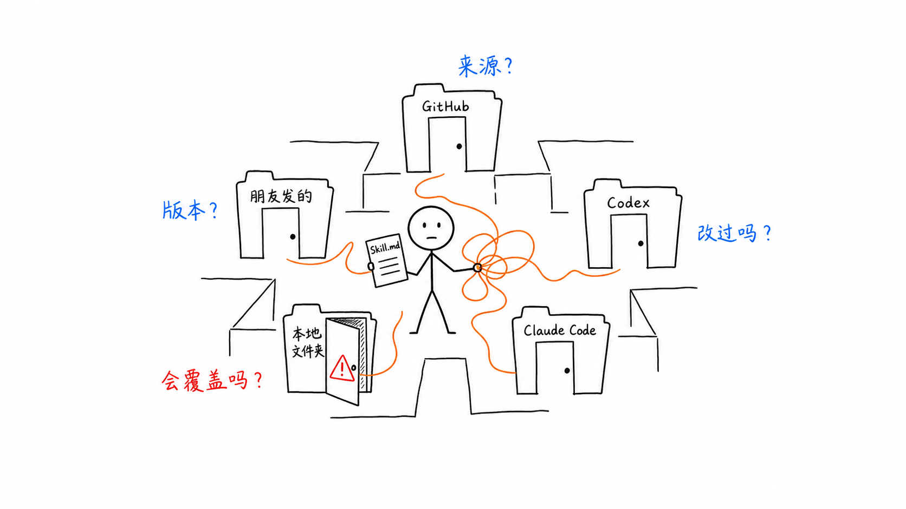
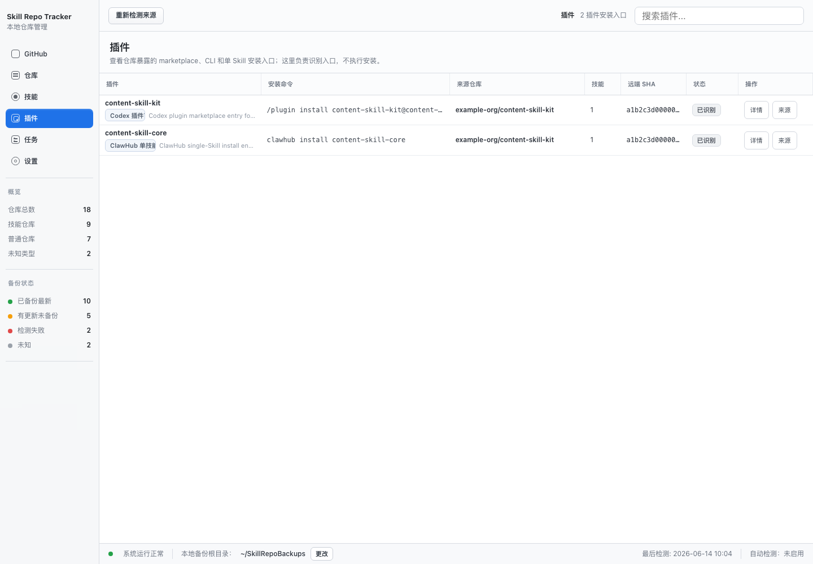
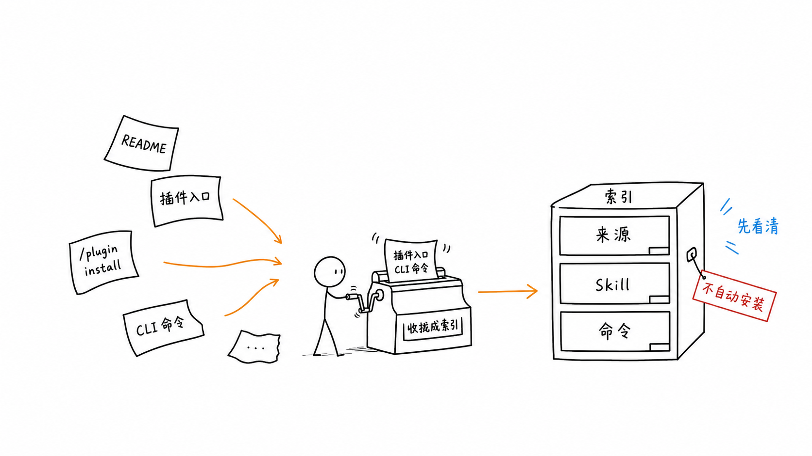
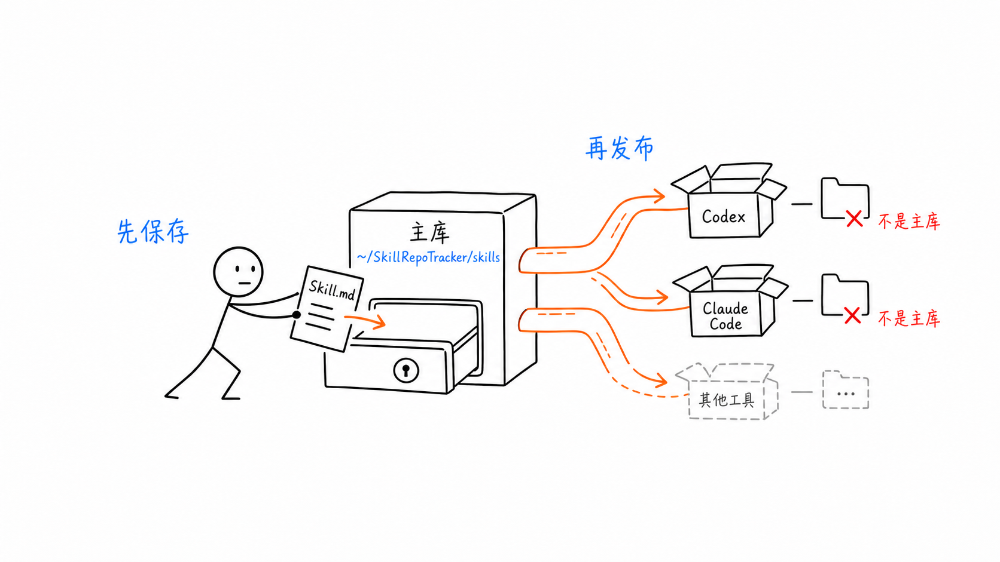
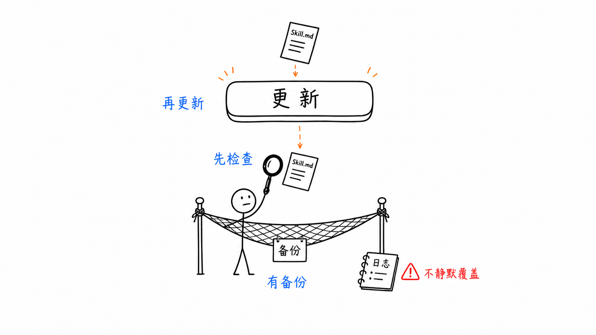
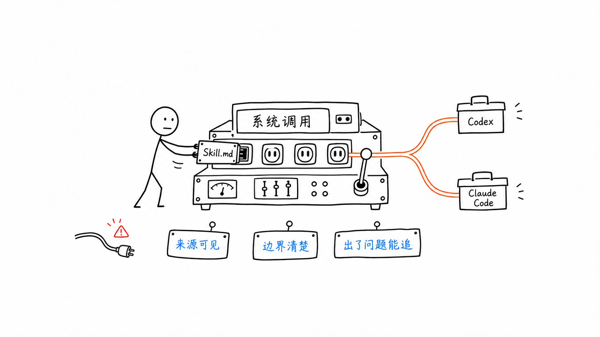

# 我给 AI Skills 做了一个能看清来源的本地工作台：Skill Repo Tracker v1.1.6

有些焦虑，不是因为工具不好用。

是因为它太好用了，你开始到处装。

今天从 GitHub 拿一个 Skill，明天在 README 里看到一条 `/plugin install`，后天又把同一份能力拷到 Claude Code 和 Codex。刚开始只是试试，过一阵子就变成一堆来源不明、版本不清、路径各异的小入口。

最危险的时刻不是“装不上”。

而是你准备更新时，心里突然停了一下：

这个东西从哪来？会改哪里？我本地是不是改过？出了问题能不能回去？

*AI Skills 不是乱在数量，而是乱在来源和边界看不见。*

Skill Repo Tracker v1.1.6，就是给这件事做的本地工作台。

它不承诺替你判断哪个 Skill 最好，也不伪装成完整插件市场。它做一件更基础、更实际的事：

把 Skill、仓库、插件安装入口、本地主库、发布目标、备份记录放到同一个可检查的地方。

先看清，再行动。

*软件截图：插件入口、来源仓库、关联 Skill 和状态被收拢到同一个工作台。*

## 真正的问题是什么

如果从第一性原理看，AI Skills 管理不是一个“文件夹整理”问题。

它更像一个小型部署系统。

你从远端拿代码，放进本地主库，再发布到不同工具目录。这里面天然有几件事必须说清楚：

- 来源：来自哪个仓库、哪个路径、哪个提交。
- 状态：本地是不是装了，版本是不是一致。
- 目标：会发布到 Claude Code、Codex，还是其他工具目录。
- 风险：更新会不会覆盖本地改动，取消同步会不会误删。
- 证据：有没有 ZIP、manifest、任务日志和备份路径。

没有这些信息，复制粘贴就变成了一套没有日志的部署系统。

能跑，但心里没底。

## v1.1.6 新增了什么

这次最重要的变化，是插件安装入口被单独收拢出来了。

很多仓库会在 README、插件清单或示例里暴露安装入口，例如 marketplace 命令、CLI 命令、单 Skill 安装命令。以前这些入口散在文档里，你看到一条命令，只知道“好像可以装”，但不知道它和哪个仓库、哪个 Skill、哪个版本有关。

v1.1.6 会识别常见插件入口，并把它们放到插件页：

- 看入口类型：marketplace、CLI、单 Skill 或结构化插件清单。
- 看来源仓库：入口从哪里被识别出来。
- 看关联 Skill：这个入口和哪些 Skill 有关系。
- 看安装命令：需要时一键复制，仍由你决定在哪里执行。

*插件入口被收拢成索引：不是自动安装，而是先把入口和来源看清楚。*

这里的边界很重要。

Skill Repo Tracker 不是完整插件市场，不做一键安装插件，不保证第三方入口安全，也不会自动理解所有依赖。它只是帮你把常见入口识别出来，和来源仓库、Skill 记录放在一起。

这已经很有价值。

因为大多数风险，第一步不是来自“装错”，而是来自“我根本不知道自己在装什么”。

## 仍然是一个本地主库工作台

插件入口只是新的一层索引。底层逻辑没有变：

真正的 Skill 主库只有一份：`~/SkillRepoTracker/skills`。

工具目录不是主库。Claude Code、Codex、Gemini、OpenCode、OpenClaw、Hermes 都只是发布目标。

*先收进主库，再发布到工具目录。边界一清楚，后面的动作才安全。*

这个设计解决了一个很现实的问题：你可以放心试，但不能失去回退能力。

安装、更新、恢复，都先进入主库；发布到工具目录，是可追踪的动作。取消同步时，应用只处理自己发布过的副本，不碰你手动维护的目录。

## 这次还修了一个底层误导

v1.1.6 还修了一个不显眼但很关键的问题：

扫描失败不能伪装成“什么都没发现”。

以前如果 ZIP、README 或插件扫描失败，最坏情况下可能降级成“0 Skills / 0 Plugins”。这对用户是误导，因为“没发现”和“没扫成功”完全不是一件事。

现在失败会进入失败态并留下任务记录。你看到的是失败，而不是一片看似干净的空白。

这听起来不酷，但这是工具可信的起点。

## 它具体适合谁

如果你符合下面任意一条，Skill Repo Tracker 会很有用：

- 你同时使用 Claude Code、Codex 或其他支持 Skills 的 AI 编程工具。
- 你经常从 GitHub 安装、试用、更新 Skills。
- 你会在 README 里看到插件安装命令，但想先知道它来自哪里。
- 你有自己的 Skill 修改版本，不希望更新时被静默覆盖。
- 你管理多个 GitHub 账号，包含私仓和 Starred 项目。
- 你希望每次同步、取消同步、恢复都有备份和日志。

它不让你少思考。

它让你有足够信息去思考。

*敢按更新的前提，是知道哪里会变，出了问题去哪找。*

## 为什么这件事值得做

AI 工具越来越像一个操作系统。

模型是 CPU，项目上下文是内存，Skills 和插件入口就是越来越多的系统调用。

系统调用一多，如果没有来源、版本、发布目标和回滚边界，最后一定会乱。

*当 Skills 变成系统调用，来源、边界和回滚就不再是洁癖，而是基础设施。*

Skill Repo Tracker 想补上的，就是这层朴素的工程秩序：

先看清来源。

再收进主库。

发布到目标目录。

更新前检查。

删除前备份。

失败时说失败。

这不是炫技。

这是让你敢于多试几个 Skill，又不用把自己的工作流交给记忆力。

## 当前状态

Skill Repo Tracker v1.1.6 面向 Apple Silicon，要求 macOS 12+。

本地验证产物未 notarize，不建议直接作为普通用户公开分发包。公开发布的 DMG 需要 Developer ID 签名并完成 Apple notarization。

项目地址：

`https://github.com/xrevoman-hu/skill-repo-tracker`

如果你已经开始认真维护自己的 AI Skills，这个工具解决的不是“装得更快”。

它解决的是：你终于知道自己装了什么、从哪里来、会被发布到哪里。
