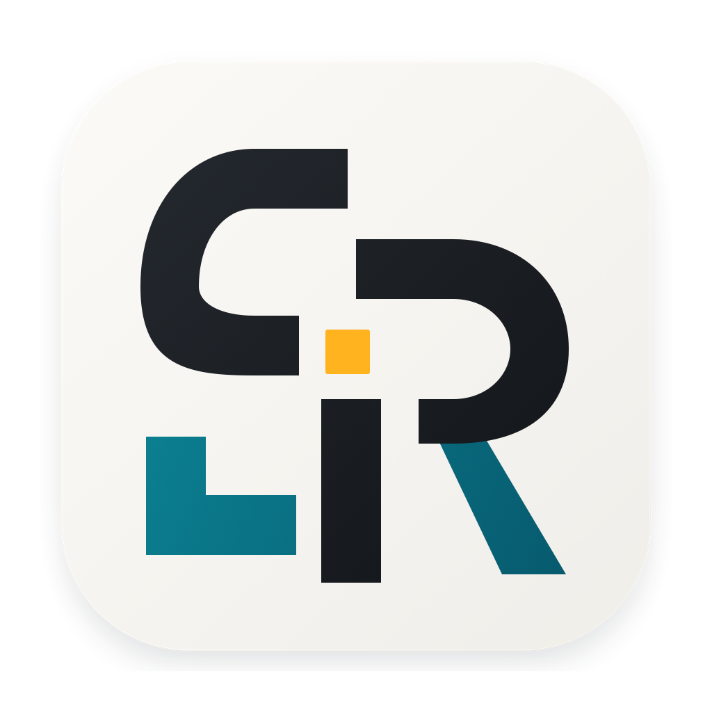
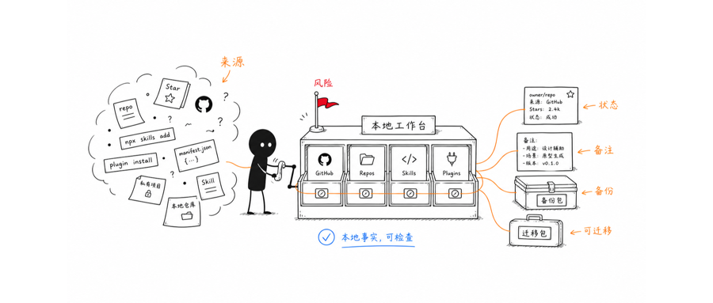

# Skill Repo Tracker v1.1.8 Promotion Kit

This folder contains the v1.1.8 WeChat article, cover image, article assets,
real app screenshots, review notes, and install-validation notes.

## Core Message

Skill Repo Tracker is not a tool for blindly installing more AI Skills. It is a
local workbench for turning scattered GitHub repositories, Skills, plugin
install entries, notes, backups, tasks, and migration data into inspectable
facts before the user acts.

## Visual Preview

  

  

The article uses the user-provided real v1.1.8 app screenshots as page evidence:

<table>
  <tr>
    <td><strong>GitHub</strong> </td>
    <td><strong>Repositories</strong> </td>
  </tr>
  <tr>
    <td><strong>Skills</strong> </td>
    <td><strong>Plugins</strong> </td>
  </tr>
  <tr>
    <td><strong>Tasks</strong> </td>
    <td><strong>Settings</strong> </td>
  </tr>
</table>

## Contents

- `wechat-article.md`: Simplified Chinese WeChat article draft.
- `product-logo.png`: product logo copied from the app icon.
- `wechat-cover.png`: WeChat cover image, 900x383.
- `article-assets/`: hand-drawn article illustrations and resized app screenshots.
- `ux-evidence/`: original real v1.1.8 app screenshots used as evidence.
- `review.md`: independent review checklist, findings, and final status.
- `install-validation.md`: local DMG install verification record.
- `asset-prompts.md`: source prompts and image QA notes for the final illustrations.

## Publishing Boundary

The v1.1.8 DMG is intended for zero-cost GitHub Release distribution as an
ad-hoc signed local installation package. It can be mounted, copied to
`/Applications`, and manually allowed by macOS Gatekeeper.

It is not a Developer ID signed and Apple-notarized public release. Do not
describe it as a no-warning installer unless that signing and notarization
chain is completed.
