# 我给 AI Skills 做了一个本地工作台：先别急着装，先看清它会动哪里

你可能也有这种感觉：

AI 编程工具越来越强，Skill 越来越多，GitHub 上随手一搜就是一堆仓库。

刚开始很爽。

看到一个仓库，装。

看到 README 里有 `/plugin install`，先收藏。

Claude Code 里放一份，Codex 里再放一份。后来又来了 Gemini、OpenCode、OpenClaw、Hermes。

真正麻烦的时刻，通常不是“装不上”。

而是你想更新、删除、迁移、分享的时候，突然停住：

这个 Skill 从哪个仓库来的？

我本地改过没有？

它现在发布到了哪些工具目录？

这个插件入口只是 README 里的一行命令，还是我已经用过？

换一台机器时，我要带走哪些记录，又不能带走哪些密钥？

这就是我做 Skill Repo Tracker 的原因。

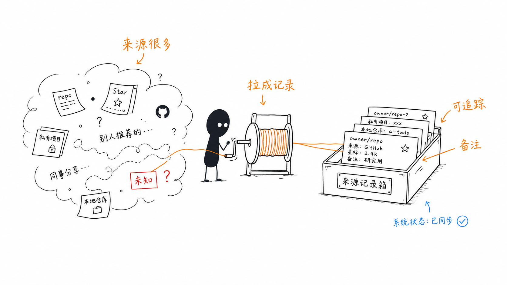

*真正让人焦虑的不是 Skill 多，而是来源、状态和动作边界都散在脑子里。*

## 第一性原理：管理 Skill，本质是在管理“可确认性”

一个 AI Skill 不是孤立文件。

它至少有四层事实：

它从哪里来。

它当前是什么状态。

你准备对它做什么动作。

如果动作出错，你能不能回头。

如果这些事实只能靠记忆，工具越多，人越慌。

所以 Skill Repo Tracker 不把自己设计成“更快安装更多东西”的工具。

它更像一个本地工作台：

先把 GitHub、仓库、Skill、插件入口、备份、任务日志、备注和迁移数据摆到桌面上。

然后你再决定要不要安装、更新、备份、取消同步或迁移。

一句话：

**先看清来源，再决定行动。**

## GitHub 页：不是逛仓库，是把来源入口收回来

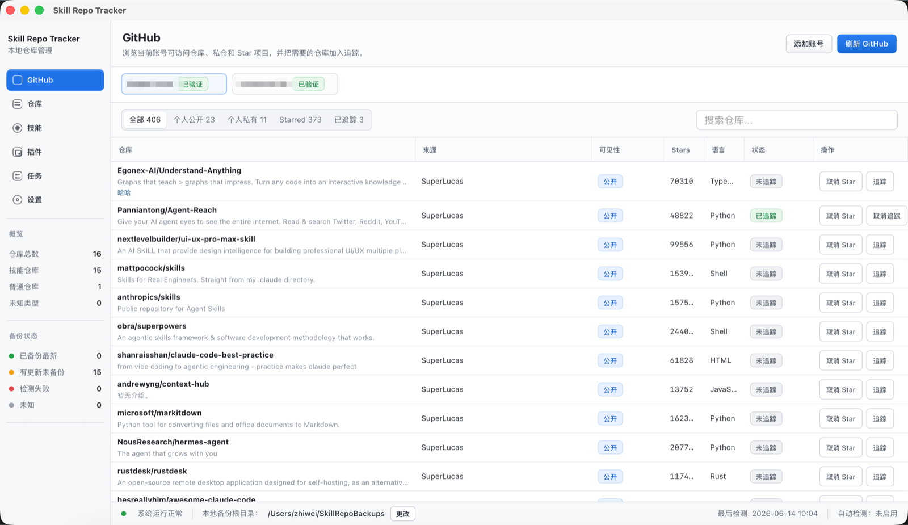

GitHub 页解决的是第一件事：来源在哪里。

你可以添加 GitHub 账号，浏览当前账号可访问的个人公开仓库、个人私仓、Starred 项目和已追踪仓库。

这里不是一个通用 GitHub 客户端。

它只关心一个问题：

这个仓库是否值得进入我的本地 Skill 工作流？

所以它把仓库来源、可见性、Star 状态、追踪状态放在同一个表里。看到合适的仓库，你可以把它加入追踪。

v1.1.8 还加入了备注。GitHub 页和仓库页里的同一个 GitHub 仓库共用一条备注。

也就是说，你只需要写一次：

“这个仓库用来做公众号排版”

或者：

“这个仓库里的插件入口只做观察，暂不执行”

之后两边都会同步显示。

这很小，但它把“我为什么关注这个仓库”从脑子里拿出来了。

## 仓库页：一行链接变成可回退档案

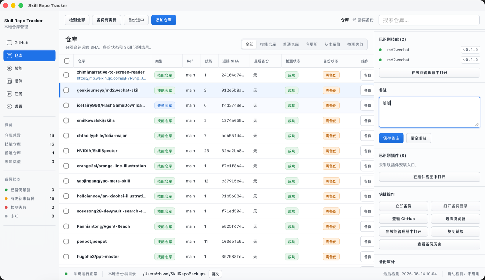

仓库页关心的是第二层事实：这个来源现在是什么状态。

它会追踪远端 SHA、Ref、仓库类型、识别出的 Skill 数量、检测状态、备份状态。

你不必每次都回 GitHub、终端、备份目录之间来回确认。

仓库如果有更新，界面会告诉你需要备份。

仓库如果检测失败，它也会把失败作为失败记录下来，不会伪装成“空白结果”。

这点很重要。

“没有发现 Skill”和“没扫成功”不是一回事。

前者是事实，后者是风险。

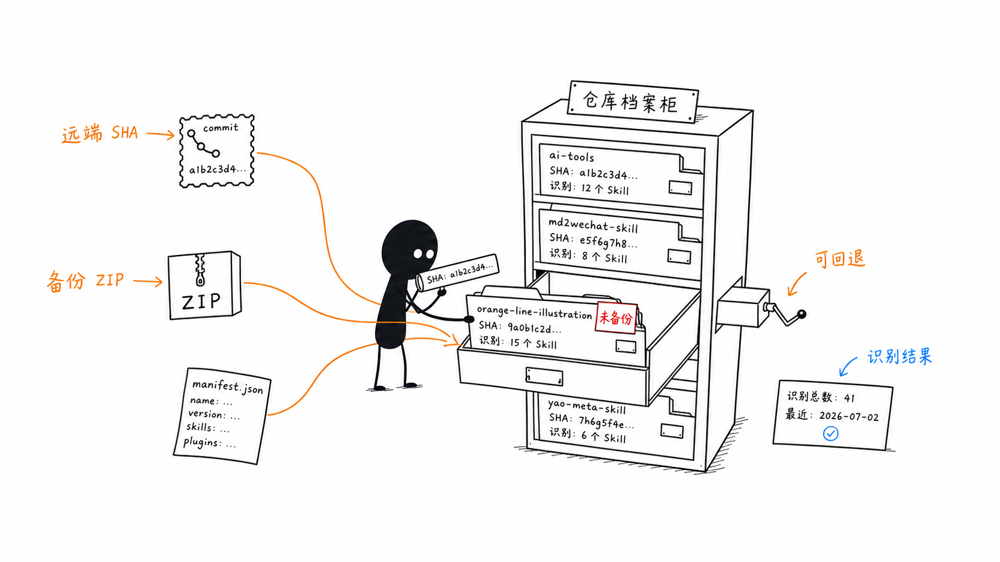

备份时，Skill Repo Tracker 关注的是可追溯性：源码 ZIP、manifest 和任务日志。

它不是完整 Git mirror。

它更像给当前可用状态拍一张快照。

当你之后要回看“当时到底备份了什么”，不是靠记忆，而是有记录。

## 技能页：主库只有一份，工具目录只是发布目标

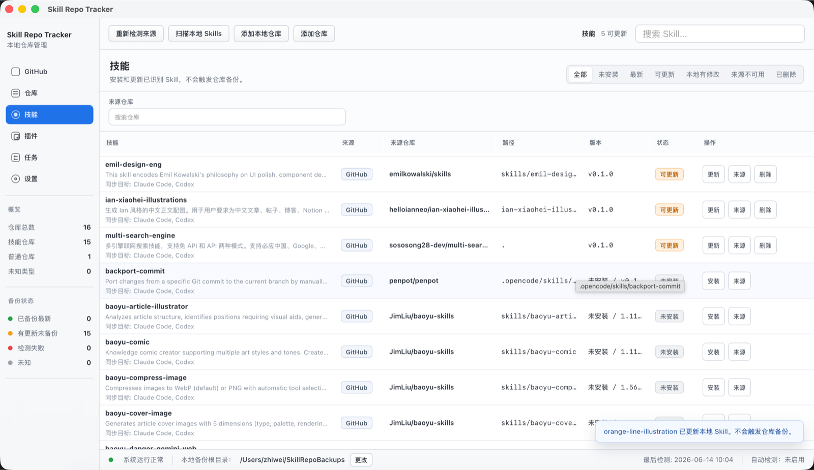

很多混乱来自一个误会：

把工具目录当成来源。

比如 Claude Code 有一份，Codex 有一份，你手动又复制了一份。过一阵子，你已经分不清哪份才是主库。

Skill Repo Tracker 的模型更简单：

真正的 Skill 主库只有一份。

默认是：

`~/SkillRepoTracker/skills`

Claude Code、Codex、Gemini、OpenCode、OpenClaw、Hermes 都只是发布目标。

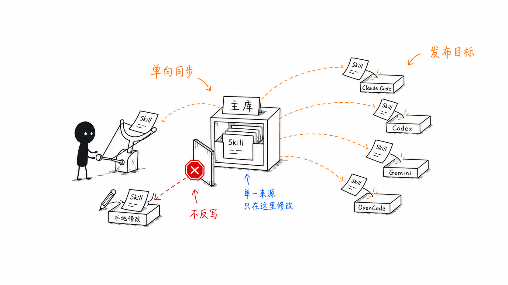

技能页会展示每个 Skill 的来源仓库、来源路径、版本、安装状态、可更新状态、同步目标和本地修改状态。

你可以安装、更新、查看来源、删除或恢复。

更新前，它会检查本地内容是否被改过。

取消同步时，它只处理自己发布过的副本，并先做备份。

这套逻辑的价值不是“操作按钮更多”。

而是你知道每一次操作会动哪里，不会凭感觉覆盖。

## 插件页：识别入口，但不替你做决定

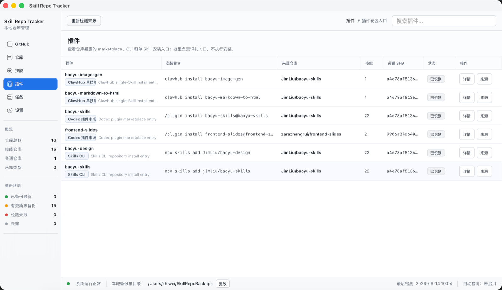

现在很多仓库不只提供 Skill，还会在 README 或 manifest 里暴露安装入口。

比如：

`/plugin install ...`

`npx skills add ...`

`clawhub install ...`

这些入口很有用，但也容易让人误判。

看到一条命令，不等于你应该立刻执行。

插件页做的事情很克制：

它把这些入口识别出来，放到一个页面里。

你可以看到安装命令、来源仓库、关联 Skill、远端 SHA 和状态。

你也可以进入详情，复制命令，回到来源仓库检查上下文。

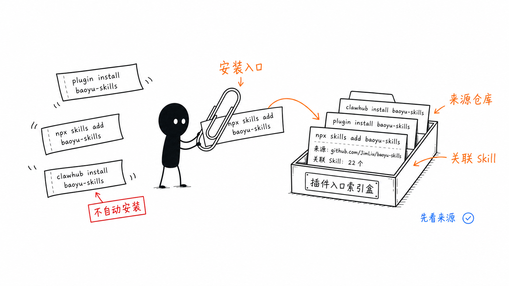

但它不会偷偷帮你安装。

这个边界是故意的。

插件入口来自不同生态，能力边界也不同。一个本地管理工具不应该假装自己已经替你完成了安全判断。

Skill Repo Tracker 在这里做的是索引和提示，不是授权和背书。

## 任务页：失败不能藏起来

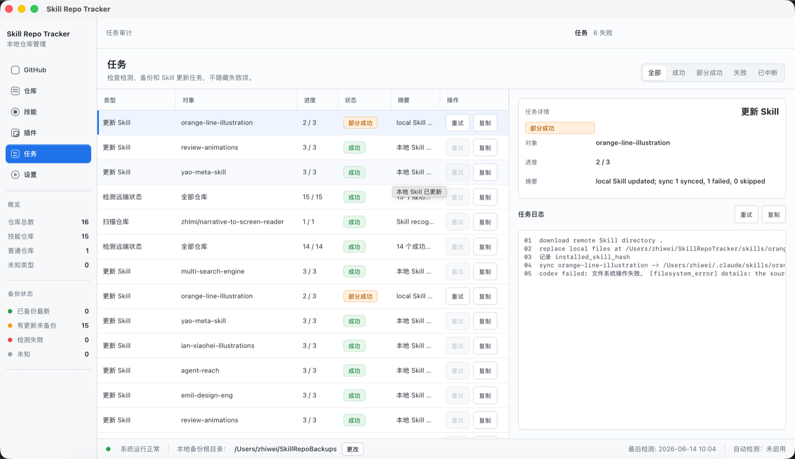

本地工具最怕一种情况：

后台失败了，前台只给你一个安静的空白。

任务页就是为了避免这种错觉。

检测、备份、安装、更新、同步、恢复，这些动作都会留下任务记录。

你可以看到类型、对象、进度、状态、摘要和日志。

失败不会被吞掉。

部分成功也不会被包装成完全成功。

这听起来不花哨，但很关键。

一个工具要让人信任，首先要承认自己没有看清的地方。

## 设置页：安全默认项和迁移包

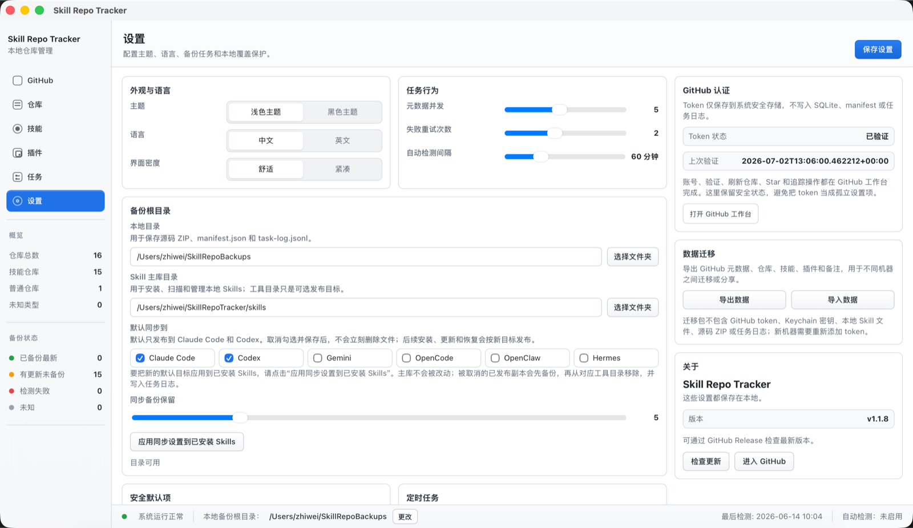

设置页不是“杂项”。

它承载的是这个工具的边界：

主题、语言、界面密度。

备份根目录。

Skill 主库目录。

默认同步目标。

本地覆盖保护。

高风险操作二次确认。

定时检测和定时备份。

GitHub token 状态。

以及 v1.1.8 新增的数据迁移。

迁移包可以导出 GitHub 元数据、仓库、Skill、插件和备注。你可以把它带到另一台机器，再合并导入。

但 GitHub token 不会导出。

Keychain 密钥不会导出。

本地 Skill 文件、源码 ZIP 和任务日志也不会塞进迁移包。

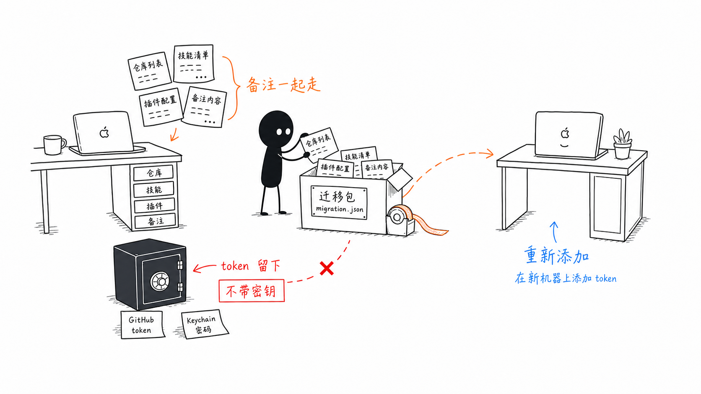

这也是第一性原理：

分享记录，不分享密钥。

迁移上下文，不迁移风险。

## v1.1.8 最值得记住的三件事

第一，备注。

GitHub、仓库、Skill、插件都可以记录用途。同一个 GitHub 仓库在 GitHub 页和仓库页共用备注。

第二，迁移包。

换机器、分享上下文、重建工作台时，不再全靠口头说明和截图。

第三，免费分发测试包。

这次会重新生成一个可挂载、可复制到 `/Applications`、可启动、可通过本地 ad-hoc 签名校验的 DMG，并上传到 GitHub Release 方便测试。

但它仍然不是 Developer ID signed 和 Apple notarized 的公开免提醒安装包。

如果你从浏览器下载，macOS 仍可能要求右键打开、在“系统设置 -> 隐私与安全性”里点“仍要打开”，或者用 `xattr -cr` 清除隔离属性。

这个边界必须说清楚。

## 它不是什么

Skill Repo Tracker 不是插件市场。

它不保证第三方 Skill 或插件入口安全。

它不会自动执行所有安装命令。

它不会把 GitHub token 写进迁移包。

它也不是完整 Git mirror。

它做的是更基础、更朴素、也更重要的事：

把原本散在 GitHub、README、本机目录、工具目录、备份文件和任务日志里的线索，整理成你能检查的事实。

## 适合谁

如果你只是偶尔复制一个 Skill，用完就忘，它可能不是必需品。

但如果你已经开始认真维护自己的 AI 工作流，它会很有用。

尤其是这些情况：

- 你同时使用 Codex、Claude Code 或其他支持 Skill 的工具。
- 你经常从 GitHub 找 Skill、试 Skill、改 Skill。
- 你看到插件安装命令时，想先知道它来自哪里。
- 你担心更新时覆盖自己的本地改动。
- 你想记录“这个仓库/Skill/插件到底用来干什么”。
- 你希望换机器时迁移管理记录，但不迁移 token。

最后，我对这个工具的定义很简单：

它不是让你更快把东西装进去。

它是让你终于知道：

你装了什么，从哪里来，会被发布到哪里，出问题时能不能回头。

项目地址：

`https://github.com/xrevoman-hu/skill-repo-tracker`
